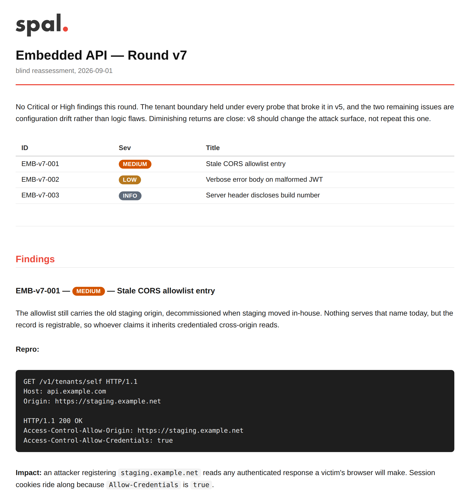

# mail-report-mcp

  

An MCP server that turns a Markdown report into a polished, email-safe HTML message and sends it over SMTP.

|                  |                                                                              |
| ---------------- | ---------------------------------------------------------------------------- |
| **In**           | Markdown from the model, plus a zip of screenshots and files                 |
| **Out**          | HTML mail with every style inlined, delivered over SMTP with retries         |
| **Clients**      | Claude Code, Codex, opencode, or a gateway such as LiteLLM                   |

It speaks streamable HTTP, so any MCP client can use it: an agent on your laptop, or a gateway that fans the tools out to every model behind it. It runs the same way either way.

## Features

- **Markdown in, email-safe HTML out.** Every style is inlined, so the message survives mail clients that strip `<style>` blocks.
- **Coloured pills.** `Critical`, `High`, `Medium`, `Low` and `Info` become pills in tables and `###` headings on their own. `MAIL_REPORT_PILLS` teaches the server words of your own, and `[[shipped|green]]` pills anything else on the spot.
- **The model needs no prompting.** The style guide ships as a tool, a resource and a prompt, so a fresh model writes the right format without you maintaining one.
- **Screenshots cost no tokens.** Zip `report.md` with its images, upload it once, and every `` is embedded inline. File bytes never pass through the model's context.
- **No long-lived secret in the agent.** Uploads run on short-lived tickets, so the auth token stays on your side.
- **Delivery is queued, not hoped for.** Retries with exponential backoff, a hard give-up window, an optional rate limit, and a `job_id` that tells you whether it actually went out.
- **Size caps come from the relay.** Attachment limits are derived from the ESMTP `SIZE` your relay advertises, rather than guessed.
- **Recipients are governed.** Three sources (the model, a per-key gateway header, a server default), one allowlist over all three, and a strict mode where each caller supplies its own address.
- **Branded per server.** Accent colour and logo are env vars. The logo is rasterized from SVG, because mail clients will not render it.
- **Closed by default.** Bearer-token auth, a separate unauthenticated health endpoint, a non-root container and a healthcheck.

## Contents

- [Quick start](#quick-start)
- [What the mail looks like](#what-the-mail-looks-like)
- [How it works](#how-it-works)
- [Environment variables](#environment-variables)
- [SMTP configuration](#smtp-configuration)
- [Attachments](#attachments)
- [Recipients](#recipients)
- [Report style](#report-style)
- [Behind a gateway: LiteLLM](#behind-a-gateway-litellm)
- [License](#license)

---

## Quick start

### 1. Make a directory

```bash
mkdir mail-report-mcp && cd mail-report-mcp
mkdir -p data
```

`data/` holds the upload spool and the delivery queue. Without that mount both are ephemeral, so queued mail is lost on restart.

### 2. `docker-compose.yml`

```yaml
services:
    mail-report-mcp:
        image: spaaleks/mail-report-mcp:latest
        # or if you prefer quay.io:
        # image: quay.io/spaaleks/mail-report-mcp:latest
        restart: unless-stopped
        env_file: .env
        ports:
            - "8000:8000"
        volumes:
            - ./data:/data
```

That publishes the port, which is what you want when the client is an agent on the same host. If the client is another container, drop the `ports:` block, put both on a shared network and let them talk by service name.

### 3. `.env`

```bash
# Copy to .env. Never commit it.
# openssl rand -hex 32
MCP_AUTH_TOKEN=

SMTP_HOST=mail.example.com
SMTP_PORT=587
SMTP_SECURITY=starttls
SMTP_USER=reports@example.com
SMTP_PASS=
SMTP_FROM=reports@example.com
SMTP_FROM_NAME=Acme Reports
SMTP_TO=you@example.com
```

`SMTP_HOST` and `SMTP_FROM` are the only required values. Omit `SMTP_USER` and `SMTP_PASS` for an unauthenticated relay. Everything else has a default, and the full list is in [Environment variables](#environment-variables).

Leave `MCP_AUTH_TOKEN` set. Anything that can reach the port can send mail as you, and the container logs a warning at startup if it is empty.

### 4. Start it

```bash
docker compose up -d
curl -s http://localhost:8000/healthz
# {"status":"ok","smtp_configured":true}
```

`smtp_configured: false` means the SMTP block did not resolve, and `docker compose logs` carries the startup error saying which value is missing.

`/healthz` needs no token. Every other path returns `401` without one.

### 5. Point a client at it

The URL is the server plus `/mcp`, and the token goes in as a bearer header.

**Claude Code**

```bash
claude mcp add --transport http mail-report http://127.0.0.1:8000/mcp \
  --header "Authorization: Bearer $MCP_AUTH_TOKEN"
```

**Codex**

```bash
codex mcp add mail-report --url http://127.0.0.1:8000/mcp \
  --bearer-token-env-var MCP_AUTH_TOKEN
```

Or in `~/.codex/config.toml`:

```toml
[mcp_servers.mail_report]
url = "http://127.0.0.1:8000/mcp"
bearer_token_env_var = "MCP_AUTH_TOKEN"
```

Codex reads the token from that environment variable at connection time, so it never lands in the config file.

**opencode**

In `opencode.json`, or `~/.config/opencode/opencode.json` to have it everywhere:

```json
{
    "mcp": {
        "mail-report": {
            "type": "remote",
            "url": "http://127.0.0.1:8000/mcp",
            "enabled": true,
            "headers": { "Authorization": "Bearer {env:MCP_AUTH_TOKEN}" }
        }
    }
}
```

**LiteLLM**

A gateway reaches it the same way, and hands the tools to every model behind it. In your LiteLLM `config.yaml`:

```yaml
mcp_servers:
    mail_report:
        url: "http://mail-report-mcp:8000/mcp" # compose service name + port
        transport: "http"
        description: "Render Markdown reports to email-safe HTML and send them over SMTP."
        auth_type: "bearer_token"
        auth_value: os.environ/MCP_AUTH_TOKEN # same value as the server's MCP_AUTH_TOKEN
```

That URL is a compose service name, which resolves when both containers share a Docker network. It is the tidiest arrangement, and it lets you drop the `ports:` block from step 2, but any URL LiteLLM can reach works, including a published port or a public hostname. More on per-key recipient routing in [Behind a gateway: LiteLLM](#behind-a-gateway-litellm).

### 6. Send the first report

Ask the agent for one in plain language:

> Read the mail-report style guide, then send me a report on what you changed today.

The model calls `report_guide`, writes the Markdown, and calls `send_report`. It gets back a `job_id`, and `report_status` says whether the mail actually left. Nothing else has to be explained to it.

If you would rather check the rendering before anything is sent, ask for `preview_report` instead. It returns the HTML and sends nothing.

---

## What the mail looks like

A pentest round, written by the model as plain Markdown in the subset the guide describes:

````markdown
# Embedded API — Round v7

No Critical or High findings this round. The tenant boundary held under every probe that broke it in v5, and the two remaining issues are configuration drift rather than logic flaws.

| ID | Sev | Title |
|------------|--------|--------------------------------------|
| EMB-v7-001 | Medium | Stale CORS allowlist entry |
| EMB-v7-002 | Low | Verbose error body on malformed JWT |
| EMB-v7-003 | Info | Server header discloses build number |

---

## Findings

### EMB-v7-001 — Medium — Stale CORS allowlist entry

The allowlist still carries the old staging origin, decommissioned when staging moved in-house. Nothing serves that name today, but the record is registrable, so whoever claims it inherits credentialed cross-origin reads.

**Repro:**

```http
GET /v1/tenants/self HTTP/1.1
Host: api.example.com
Origin: https://staging.example.net

HTTP/1.1 200 OK
Access-Control-Allow-Origin: https://staging.example.net
Access-Control-Allow-Credentials: true
```

**Impact:** an attacker registering `staging.example.net` reads any authenticated response a victim's browser will make.

**Fix:** drop the entry from `config/cors.yaml`, and fail the deploy when an allowlist origin stops resolving. See the [CORS notes](https://example.com/docs/cors).
````

That is the whole input. No HTML, no template, no styling decision from the model. Here is the mail it produces, as the recipient sees it:



`Medium`, `Low` and `Info` in that table became pills without being marked up. The full report this was cut from, severity legend and all, lives in `tests/sample_report.py`.

### The calls behind it

```
send_report(
  subject="Embedded API — Round v7",
  title="Embedded API — Round v7",
  subtitle="blind reassessment, 2026-09-01",
  body="# Embedded API — Round v7\n\nNo Critical or High findings this round. …",
)
```

The `# Embedded API — Round v7` heading is dropped from the body because it repeats `title`, so passing both is safe. The call returns as soon as the mail is queued, not when it is sent:

```json
{
    "queued": true,
    "job_id": "job_4f1c8a2b6d0e7391a5c2b8f4",
    "to": ["you@example.com"],
    "subject": "Embedded API — Round v7",
    "recipient_source": "default",
    "attachments": [],
    "inline_images": [],
    "attachment_bytes": 0,
    "html_bytes": 18379,
    "note": "Delivery runs in the background with retries. Call report_status with this job_id to confirm."
}
```

`recipient_source` is `argument`, `header` or `default`, so the model can see which of the three [recipient sources](#recipients) applied. Then:

```
report_status(job_id="job_4f1c8a2b6d0e7391a5c2b8f4")
```

```json
{
    "job_id": "job_4f1c8a2b6d0e7391a5c2b8f4",
    "state": "delivered",
    "attempts": 1,
    "queued_at": 1756901400.12,
    "updated_at": 1756901401.86,
    "delivered_at": 1756901401.86,
    "result": {
        "sent": true,
        "to": ["you@example.com"],
        "subject": "Embedded API — Round v7",
        "attachments": [],
        "attachment_bytes": 0,
        "message_bytes": 27402,
        "html_bytes": 18379,
        "logo": "logo.svg",
        "inline_images": []
    }
}
```

While it is still in the queue `state` is `queued` or `active`, and a report that keeps failing ends at `failed` with `last_error` naming the SMTP reason.

---

## How it works

```
MCP client --> mail-report (port 8000) --> SMTP relay --> inbox
    ^               |
    |               +--> upload endpoint (files, bypassing the model)
    +-- tools, resource, prompt
```

The client is anything that speaks MCP: an agent such as Claude Code or opencode talking to it directly, or a gateway such as LiteLLM that exposes the tools to the models behind it.

1. The model reads `guide://report-style` and writes the report in Markdown
2. For a report with images, it calls `request_upload_ticket` and posts a zip straight to the upload endpoint
3. `send_report` renders the Markdown, resolves attachments and queues the mail
4. A background worker delivers it, retries on transient SMTP failures and deletes the files once sent
5. `report_status` reports whether it actually went out

| Tool                    | Purpose                                                                     |
| ----------------------- | --------------------------------------------------------------------------- |
| `smtp_status`           | Where mail will go, the upload URL, size limits and the recipient policy    |
| `report_guide`          | The report style guide, same content as the `guide://report-style` resource |
| `preview_report`        | Render Markdown to HTML without sending                                     |
| `request_upload_ticket` | A short-lived ticket for posting files to the upload endpoint               |
| `send_report`           | Queue a report for delivery                                                 |
| `report_status`         | State of a queued report: queued, active, delivered or failed               |

### Running it without compose

```bash
docker run --rm \
  -p 8000:8000 \
  -e MCP_AUTH_TOKEN=your-token \
  -e SMTP_HOST=mail.example.com \
  -e SMTP_FROM=reports@example.com \
  -e SMTP_TO=you@example.com \
  -v "$(pwd)/data:/data" \
  spaaleks/mail-report-mcp:latest
```

Instead of environment variables you can mount a dotenv file read-only at `/config/.env`.

---

## Environment variables

| key                                | default                                | notes                                                                                            |
| ---------------------------------- | -------------------------------------- | ------------------------------------------------------------------------------------------------ |
| `MCP_HOST`                         | `127.0.0.1` (`0.0.0.0` in the image)   | bind address                                                                                     |
| `MCP_PORT`                         | `8000`                                 |                                                                                                  |
| `MCP_ATTACH_PATH`                  | `/attachments`                         | upload endpoint                                                                                  |
| `MCP_UPLOAD_URL`                   | _(unset)_                              | absolute URL uploads are reachable at, advertised to callers when it differs from the MCP host   |
| `MCP_AUTH_TOKEN`                   | _(unset)_                              | when set, requires `Authorization: Bearer <token>` (or `X-API-Key`) on everything but `/healthz` |
| `MCP_ALLOWED_HOSTS`                | _(unset)_                              | comma-separated `Host` allowlist. `mcp.example.com:*` matches any port. See the note below       |
| `MCP_LOG_LEVEL`                    | `INFO`                                 |                                                                                                  |
| `MAIL_REPORT_ALLOW_TO_ARG`         | `true`                                 | whether the model may name a recipient                                                           |
| `MAIL_REPORT_REQUIRE_TO`           | `false`                                | drop the `SMTP_TO` fallback: every report needs an address from the caller. See [Recipients](#recipients) |
| `MAIL_REPORT_ALLOWED_RECIPIENTS`   | _(unset)_                              | allowlist applied to every recipient whatever its source. `*@example.com` matches a domain       |
| `MAIL_REPORT_MAX_ATTACHMENT_BYTES` | 25 MiB, or the message budget if lower | largest single file                                                                              |
| `MAIL_REPORT_MAX_TOTAL_BYTES`      | derived from the relay                 | largest combined payload per mail. Replaces the relay-derived budget, so a value above what the relay takes just moves the rejection to the relay |
| `MAIL_REPORT_ATTACH_TTL`           | `86400`                                | how long an unused upload survives the sweeper                                                   |
| `MAIL_REPORT_MAX_ATTEMPTS`         | `5`                                    | delivery attempts before giving up, `0` means unlimited                                          |
| `MAIL_REPORT_RETRY_WINDOW_SECONDS` | `3600`                                 | hard stop for retries even when attempts are unlimited, `0` disables                             |
| `MAIL_REPORT_MAX_PER_MINUTE`       | `0`                                    | outbound messages per minute, `0` means no limit                                                 |
| `MAIL_REPORT_LOGO`                 | `assets/logo.svg`                      | logo shown above the title. SVG, PNG, JPG, GIF or WEBP                                           |
| `MAIL_REPORT_LOGO_WIDTH`           | `100`                                  | display width in px                                                                              |
| `MAIL_REPORT_ACCENT`               | `#ec483b`                              | brand colour of section headings, links, the title rule and blockquotes. `#rgb` or `#rrggbb`     |
| `MAIL_REPORT_PILLS`                | _(unset)_                              | extra pill words beyond the severities. `Word=#rrggbb`, comma separated. See [Pills](#pills)     |

DNS-rebinding protection follows `MCP_HOST` and covers `/mcp`: a loopback bind validates the `Host` header automatically (a request claiming `Host: evil.example.com` gets `421`), while binding `0.0.0.0`, as the image does, leaves it off until you list hosts in `MCP_ALLOWED_HOSTS`. Behind a reverse proxy, list the public hostname there.

Mount `/data`. Uploads land in `/data/attachments`, the delivery queue in `/data/state` (mode 0700). Without the mount both are ephemeral and queued mail is lost on restart. `send_report` only accepts `att_…` ids, never paths, so a caller cannot name a file of its own choosing.

---

## SMTP configuration

Resolution order: `<project-root>/.env` → `/config/.env` → `./.env`, with process environment variables overriding whichever file was found.

| key                       | required | notes                                                  |
| ------------------------- | -------- | ------------------------------------------------------ |
| `SMTP_HOST`               | yes      |                                                        |
| `SMTP_FROM`               | yes      | From: address                                          |
| `SMTP_FROM_NAME`          | no       | display name shown before it, e.g. `Acme Reports`      |
| `SMTP_TO`                 | no       | default recipient (a `send_report` `to` arg overrides) |
| `SMTP_PORT`               | no       | default `587`                                          |
| `SMTP_USER` / `SMTP_PASS` | no       | omit for an unauthenticated relay                      |
| `SMTP_SECURITY`           | no       | `starttls` (default) · `ssl` (465) · `none`            |

---

## Attachments

Files go in through the upload endpoint and come back as `att_…` ids, so a remote caller never needs a file path.

The model calls `request_upload_ticket` first and posts with the short-lived ticket it gets back, which keeps any long-lived secret out of the agent's environment. With `MCP_AUTH_TOKEN` you can post directly:

```bash
curl -H "Authorization: Bearer $MCP_AUTH_TOKEN" -F file=@shot.png \
     https://reports.example.com/attachments
# {"id":"att_64dbb3…","filename":"shot.png","bytes":18422,"expires_in_seconds":86400}
```

```
send_report(subject=…, body=…, attachments=["att_64dbb3…"])
```

`--data-binary @shot.png -H "X-Filename: shot.png"` works too, if that is easier to generate. Uploads are swept after `MAIL_REPORT_ATTACH_TTL`.

### Bundles

A report with pictures goes in as a bundle. Zip `report.md` together with its images and any files, upload it once, and pass the returned `bundle_id`:

```
report.md      referenced: 
login.png
console.png
findings.pdf   not referenced, so it is attached normally
```

```bash
curl -H "X-Upload-Ticket: $TICKET" --data-binary @bundle.zip \
     -H "X-Filename: bundle.zip" https://reports.example.com/attachments
# {"bundle_id":"bnd_…","report":true,"files":{...}}
```

```
send_report(subject="…", bundle_id="bnd_…")
```

`report.md` becomes the body, every `` reference is embedded as an inline `cid:` part so the recipient sees it in place, and unreferenced files ride along as attachments. File bytes never travel through the model's context.

### Exposing uploads without exposing MCP

`/mcp` and the upload endpoint are separate paths, so you can publish one and keep the other internal. Set `MCP_UPLOAD_URL` to the public URL uploads end up on. The server hands it to callers via `smtp_status` and names it in error messages, so set it whenever uploads are reachable somewhere other than the MCP host.

Publishing only uploads, with `/mcp` staying on the internal network. In a `Caddyfile`:

```caddy
reports.example.com {
    reverse_proxy /attachments mail-report-mcp:8000
}
```

The same in an nginx `server` block:

```nginx
server {
    listen 443 ssl;
    server_name reports.example.com;

    ssl_certificate     /etc/ssl/reports.example.com/fullchain.pem;
    ssl_certificate_key /etc/ssl/reports.example.com/privkey.pem;

    location /attachments {
        proxy_pass http://mail-report-mcp:8000;
        proxy_set_header Host $host;
        client_max_body_size 25m;
    }
}
```

nginx caps request bodies at 1 MB, so `client_max_body_size` has to be at least as large as `MAIL_REPORT_MAX_ATTACHMENT_BYTES` or uploads come back as `413` before they ever reach the server.

Then tell the server where uploads ended up, in the compose file's `environment:` block:

```yaml
environment:
    MCP_UPLOAD_URL: "https://reports.example.com/attachments"
```

`MCP_ATTACH_PATH` is a separate knob that moves the path the server itself listens on, default `/attachments`. You only need it if that path collides with something else behind the same proxy.

`/healthz` is the only unauthenticated path. The upload endpoint accepts a short-lived `X-Upload-Ticket`, which is what the model uses so no long-lived secret ever reaches the agent's environment, or `MCP_AUTH_TOKEN` for your own curl.

---

## Recipients

Three sources, tried in order, and the result says which one applied (`recipient_source`):

|     | source                        | set by                                    |
| --- | ----------------------------- | ----------------------------------------- |
| 1   | the `to` argument             | the model, when the user names an address |
| 2   | the `x-mail-report-to` header | your gateway, per API key                 |
| 3   | `SMTP_TO`                     | the server's config                       |

The header is read straight off the request, so the model never sees or controls it. Any gateway that can set a per-key header can drive it. With LiteLLM, a caller sends `x-mcp-mail_report-x-mail-report-to: team-a@example.com` and the header is forwarded as `x-mail-report-to`, provided the name is listed in that server's `extra_headers`.

`send_report` sends mail on your behalf, so three settings are worth reviewing:

- `MAIL_REPORT_ALLOW_TO_ARG=false` turns off the first source, leaving routing to the gateway. The `to` parameter is then absent from the tool schema, so the model has no address to offer.
- `MAIL_REPORT_REQUIRE_TO=true` turns off the third. See below.
- `MAIL_REPORT_ALLOWED_RECIPIENTS` bounds every source at once, for example `*@example.com,boss@partner.example`. Whichever source an address came from, it is checked against this list before the mail is queued, including an address the user just typed at the model's prompt. Without it, whoever can set the header or the argument can send your reports anywhere.

Addresses are validated for shape before any of that, so a newline cannot smuggle extra headers into the message.

### Requiring an explicit recipient

`SMTP_TO` is a convenience: leave `to` off and the report lands in the office mailbox. That is the wrong default for a shared dev server, where each developer should get their own mail rather than everyone's drafts arriving at one address.

`MAIL_REPORT_REQUIRE_TO=true` removes source 3. The address then has to come from the caller, either way round:

- **Pinned per client.** Set the `x-mail-report-to` header in the MCP client config, next to the auth token, and every report from that client goes to that developer. Nothing is asked, nothing changes in how the model works.

    ```bash
    claude mcp add --transport http mail-report http://127.0.0.1:8000/mcp \
      --header "Authorization: Bearer $MCP_AUTH_TOKEN" \
      --header "x-mail-report-to: dev@example.com"
    ```

    Or the same header in `opencode.json`:

    ```json
    {
        "mcp": {
            "mail-report": {
                "type": "remote",
                "url": "http://127.0.0.1:8000/mcp",
                "enabled": true,
                "headers": {
                    "Authorization": "Bearer {env:MCP_AUTH_TOKEN}",
                    "x-mail-report-to": "dev@example.com"
                }
            }
        }
    }
    ```

- **Asked per report.** With no header set, `send_report` refuses and answers `{"queued": false, "needs": "recipient", ...}` with an instruction to ask the user for an address and call again with `to`. The style guide's Recipients section switches to match, so the model asks before writing the report rather than after. Nothing is delivered in the meantime, and the model is told not to guess an address. The answer it comes back with is still an ordinary `to` argument, so `MAIL_REPORT_ALLOWED_RECIPIENTS` applies to it like any other.

`SMTP_TO` is ignored entirely in this mode, so it can stay in the container's environment. The server logs which mode it is in at startup, and `smtp_status` reports it as `recipients.require_explicit`. This is off by default: a plain `SMTP_TO` server keeps working exactly as before.

---

## Report style

Write Markdown in a supported subset (headings, bold, inline/fenced code, pipe tables, bullet lists, blockquotes, rules, links). Ask the model to read `guide://report-style`, or call the `report_guide` tool, and it gets the full layout guide without you writing one.

### Pills

Two ways to get one, and they cover different jobs.

**Words the server knows.** `Critical`, `High`, `Medium`, `Low` and `Info` become pills on their own, in `###` headings and table body cells. Elsewhere they stay plain text, so a `High` in a sentence reads as a word rather than a badge. `MAIL_REPORT_PILLS` adds words of your own, as `Word=#rrggbb` pairs:

```bash
MAIL_REPORT_PILLS="Passed=#2f855a,Failed=#c53030,Flaky=#b7791f,In Progress=#5f6b7a"
```

```
| Suite      | Result | Notes        |
|------------|--------|--------------|
| auth       | Passed |              |
| billing    | Failed | 3 cases      |
| migrations | Flaky  | retry 2 of 3 |
```

Same rules as the severities: tables and `###` headings only, matched on the exact spelling you configured, and phrases with spaces are fine. Reusing a severity word re-themes it, so `MAIL_REPORT_PILLS="High=#7b1020"` changes the colour High renders in. The words in effect are listed by `smtp_status` and appended to the style guide the model reads, so it writes `Passed` in a result column without being told.

**Anything else, marked inline.** For a one-off label there is `[[word|colour]]`, and it works anywhere: prose, list items, headings, table cells.

```
The `swordfish` account is [[unowned|red]] and the migration is [[shipped|green]].

### Provisioning flow [[Blocked|amber]]
```

Colours are `red`, `orange`, `amber`, `green`, `teal`, `blue`, `purple`, `pink`, `grey`, `black`, `accent` (your `MAIL_REPORT_ACCENT`) or a `#rrggbb` value. Written without one, `[[shipped]]` comes out grey, unless the word is in the server's vocabulary, in which case it takes that colour. An unrecognised colour name falls back to grey rather than failing the send.

Inside a table cell the pipe has to be escaped, `[[unowned\|red]]`, because an unescaped one starts a new column. Escaped pipes work in any cell now, so a shell pipe in a code span survives too.

Both forms render to an inlined `style` attribute on a `<span>`. There is no stylesheet involved, because a mail client that strips `<style>` would strip the pills with it.

### Logo

The logo sits above the title. `assets/logo.svg` ships with the image and is used unless `MAIL_REPORT_LOGO` points somewhere else, so replacing it means mounting your own file and naming it:

```yaml
services:
    mail-report-mcp:
        volumes:
            - ./data:/data
            - ./brand/acme.svg:/brand/acme.svg:ro
        environment:
            MAIL_REPORT_LOGO: "/brand/acme.svg"
            MAIL_REPORT_LOGO_WIDTH: "140"
```

SVG, PNG, JPG, GIF or WEBP, up to 2 MiB. An SVG is rasterized to PNG at twice the display width before it goes out, because mail clients do not render SVG and an `` pointing at one shows a broken image in most of them. That conversion needs cairosvg, which the image already carries. Point the variable at a PNG if you would rather not depend on it.

`MAIL_REPORT_LOGO_WIDTH` is the display width in pixels, default `100`, and it has to land between 16 and 1200. The file is read once and cached against its path, size and modification time, so dropping a new file in the same place is picked up on the next report without restarting the container.

In the mail the logo travels as an inline `cid:` part rather than a link, so it appears without the client fetching anything remote. `preview_report` inlines it as a data URI instead, which is why preview HTML comes out larger than the message that is actually sent.

`smtp_status` reports the path in use, whether it loaded and how large it is. If no logo loads at startup, `send_report` drops the `include_logo` argument from its schema rather than offering the model something that does nothing. When one does load, `include_logo=false` leaves it off a single report.

### Accent colour

The accent colour is one env var. `MAIL_REPORT_ACCENT=#2f6f4f` turns section headings, links, the rule under the title and the blockquote bar green, and the blockquote's background tint is mixed from it. Severity pills keep their own colours by default, because Critical and High mean red whatever your brand is, though `MAIL_REPORT_PILLS` overrides any of them and `[[shipped|accent]]` opts a single pill into the accent. The value goes straight into a `style` attribute, so it must be `#rgb` or `#rrggbb`: colour names and `rgb()` are rejected. `smtp_status` reports the colour in effect, and `preview_report` returns it alongside the HTML.

### Placeholders are not expanded

Everything passed to `send_report` is literal text. There is no shell and no template engine behind it, so a model that writes `$(date +%F)` into a subtitle is writing those nine characters into the email. `send_report` refuses to queue a report whose `subject`, `title`, `subtitle` or body still holds a `$(…)`, `${…}` or `{{…}}`, and names the offenders, so the model resolves the value and calls again instead of the recipient reading the placeholder. Inside a code span or fenced block the token is content, not a placeholder, and passes through untouched. `preview_report` reports the same finding as a `warning` rather than an error.

---

## Behind a gateway: LiteLLM

[LiteLLM](https://github.com/BerriAI/litellm) is one MCP gateway among several. A gateway needs two things from this server: the bearer token, and a forwarded header if you want per-key recipient routing.

`litellm-config.example.yaml` holds this block. Merge it into your LiteLLM `config.yaml`:

```yaml
mcp_servers:
    mail_report:
        url: "http://mail-report-mcp:8000/mcp" # compose service name + port
        transport: "http"
        description: "Render Markdown reports to email-safe HTML and send them over SMTP."
        auth_type: "bearer_token"
        auth_value: os.environ/MCP_AUTH_TOKEN # same value as the server's MCP_AUTH_TOKEN
```

`auth_value` has to resolve to the same token the server runs with, when the server sets one at all. The `url` above assumes the two containers share a Docker network, which is the common setup, but anything LiteLLM can reach is fine. It then offers the tools to any tool-calling model and re-exposes the server at `http://<litellm>:4000/mail_report/mcp`.

---

## License

MIT
